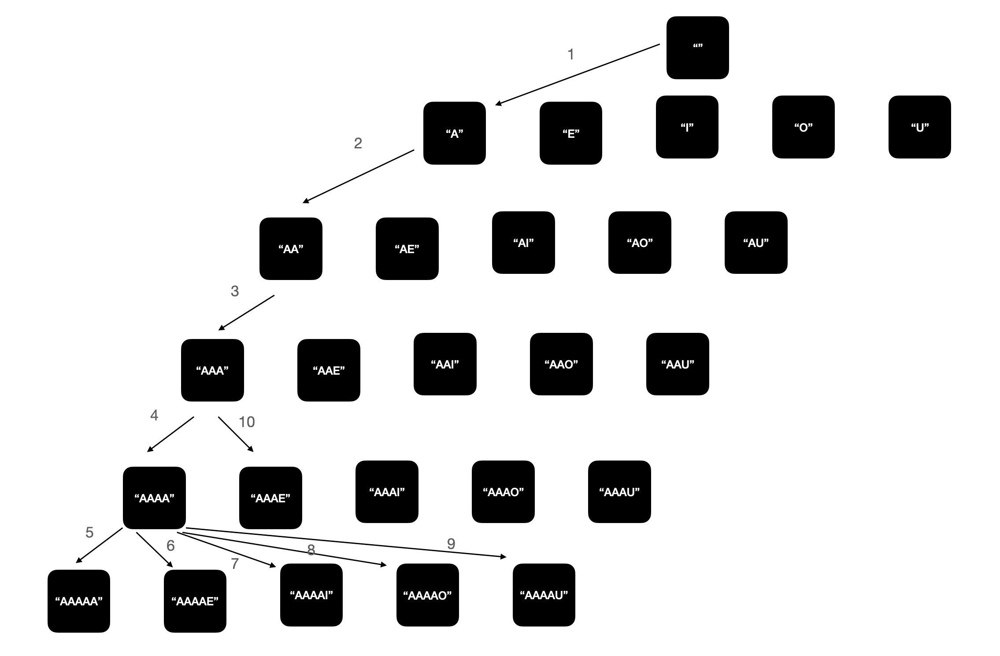

# \[ALGORITHM\] 모음사전

## 문제

이 문서에서 다룰 문제 "모음사전"는 "프로그래머스 > 코딩테스트 연습 > 위클리 챌린지 > 5주차" 문제이다. 문제 링크는 다음과 같다.

* [https://programmers.co.kr/learn/courses/30/lessons/84512](https://programmers.co.kr/learn/courses/30/lessons/84512)

## 문제 풀이

먼저 문제의 입력은 다음과 같다.

* word string

제한 사항은 다음과 같다.

* 1 <= len(word) <= 5
* word는 A, E, I, O, U로만 이루어져 있다.

이 문제의 핵심은 A, E, I, O, U로만 이루어진 단어 사전을 만드는 것이 중요하다. 만들어지는 순서는 다음과 같아야 한다.

```
A
AA
AAA
AAAA
AAAAA
AAAAE
AAAAI
AAAAO
AAAAU
AAAE
AAAEA
AAAEE
AAAEI
AAAEO
AAAEU
AAAI
...
```

위 과정을 유심히 살펴보면 다음과 같은 규칙을 찾아낼 수 있다.

```
A(01) - AA (02) - AAA(03) - AAAA (04) - AAAAA (05)
                                        AAAAE (06)
                                        AAAAI (07)
                                        AAAAO (08)
                                        AAAAU (09)
                            AAAE (10) - AAAEA (11)
                                        AAAEE (12)
                                        AAAEI (13)
                                        AAAEO (14)
                                        AAAEU (15)
                            AAAI
                            AAAO
                            AAAU
                  AAE 
                  AAI
                  AAO
                  AAU
        AE
        AI
        AU
        AO
....
```

결국 사전은 트리 구조의 형태로 구성이 되는 것을 확인할 수 있다. 



이런 경우 for문 보다는 재귀 함수를 구현하는 것이 훨씬 쉽다. 다음은 재귀 함수를 통해서 사전을 만드는 방법을 기술한다.

```
def make_dict(curr_word, dict, curr_length):
  # 재귀 탈출 조건
  if curr_length == 5:
    return

  for letter in ['A', 'E', 'I', 'O', 'U']:
    # A - U까지 차례대로 추가된다.
    next_word = curr_word + letter 
    dict.append(next_word)
    # 재귀 호출 구간
    make_dict(next_word, dict, curr_length + 1) 
```

그 후 이렇게 만든 사전에 대해서 주어진 `word`가 몇 번째인지 확인하면 된다. 다음은 해당 방법을 기술한다.

```
idx = 0

for elem in dict:
   if word == elem:
      break
   idx += 1

return idx + 1
```

## 코드

코드는 크게 2가지 부분으로 나뉜다.

1. 사전을 만드는 과정
2. 사전에서 주어진 word가 몇 번째 단어인지 찾는 과정

먼저 첫 번째 사전을 만드는 과정이다. 이는 위에서 설명했듯이 재귀 함수를 통해서 쉽게 구현할 수 있다. 다음은 해당 내용을 파이썬으로 구현한 코드이다.

```python
LETTERS = ['A', 'E', 'I', 'O', 'U']
MAX_LEN = 5

def make_dict(curr, _dict, length):
    if length == MAX_LEN:
        return 
    
    for letter in LETTERS:
        _next = curr + letter
        _dict.append(_next)
        make_dict(_next, _dict, length+1)
    
def solution(word):
    _dict = []

    for letter in LETTERS:
        _dict.append(letter)
        make_dict(letter, _dict, 1)

    # ...
```

그 후 이렇게 순차적으로 만들어진 사전에서 인덱스를 찾으면 된다. 파이썬 코드에서는 `list`의 메서드 `index`를 이용하면 쉽게 구현할 수 있다. 참고적으로 인덱스는 0부터 시작이니 문제에서 표현한 "순서"를 나타내려면 찾은 인덱스에 +1을 해주어야 한다. 

```python
# ...

def solution(word):
    # ...
    answer = _dict.index(word) + 1
    return answer
```

전체 코드는 다음과 같다.

```python
LETTERS = ['A', 'E', 'I', 'O', 'U']
MAX_LEN = 5

def make_dict(curr, _dict, length):
    if length == MAX_LEN:
        return 
    
    for letter in LETTERS:
        _next = curr + letter
        _dict.append(_next)
        make_dict(_next, _dict, length+1)
    
def solution(word):
    _dict = []
    # 1. 사전을 만드는 과정
    for letter in LETTERS:
        _dict.append(letter)
        make_dict(letter, _dict, 1)
    
    # 2. 사전에서 word가 몇 번째 단어인지 찾는 과정
    answer = _dict.index(word) + 1
    return answer
```